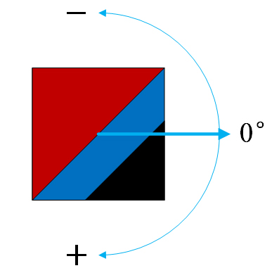

# V5RPC
[Simuro5v5](https://github.com/npuv5pp/Simuro5v5)比赛平台使用的通信模块。

## 文档

### 概述
新比赛平台使用网络与双方的策略服务器通信。本模块实现了底层通信协议和比赛通信接口，并面向平台和策略提供了对应的实现类。
如果你使用C#等语言编写策略，并运行于.NET CLR环境，则你可以直接引用此程序集。

如果你使用C/C++等语言编写策略，并希望将策略编译为DLL，请使用[V5DLLAdapter](https://github.com/npuv5pp/V5DLLAdapter)。

你也可以通过引用[protobuf协议文件](./V5RPC/Proto/API.proto)为你喜欢的语言实现相同通讯协议的接口。本模块只是作为参考的C# .NET Standard类库。

### 系统要求
本模块为.NET Standard 2.0类库。若要引用此类库，你需要满足条件的对应平台的SDK。
- .NET Framework 4.6.1或更高版本
- .NET Core 2.0或更高版本

### 基本概念
比赛所用的通信协议分为上下两层。下层协议负责数据报文的传输，上层协议负责实现比赛逻辑。

考虑到旧平台的通信方式为策略DLL导出相应接口供比赛平台调用，双方代码同时在比赛平台内不受限制地执行所导致的一系列问题，
新的通信方式使用网络协议取代了DLL接口，并采用了远程过程调用（RPC）风格。
- **客户端**：指调用的发起方，即比赛平台。比赛平台会不停地向双方队伍的策略服务器发起调用，并将结果作为双方机器人的行动依据。
- **服务器**：指调用的接受方，即策略服务器。双方的策略均作为服务器存在，接受平台的调用并返回相应的结果。
- **下层协议**：下层协议由`V5RPC.cs`中的`V5Client`和`V5Server`类实现。该协议基于UDP，设计目标是提供一个简单可靠的数据报协议，拥有确认和重传机制，
保证客户端发起的单次调用会被服务器处理至少一次。
- **上层协议**：上层协议使用Protocol Buffer封装比赛逻辑。`V5RPC/Proto`文件夹中的proto源代码定义了相关的数据结构，
在生成项目时会被编译为对应的C#源代码。`StrategyClient`类基于比赛逻辑封装了客户端功能，由比赛平台使用。
`StrategyServer`类基于比赛逻辑封装了服务器功能，编写策略时只需创建该类的实例并提供`IStrategy`接口的实现即可。

### 比赛通信接口
策略需要处理如下的RPC调用：

```csharp
void OnEvent(EventType type, EventArguments arguments);

TeamInfo GetTeamInfo(ServerInfo);

(Wheel[], ControlInfo) GetInstruction(Field field);

Placement GetPlacement(Field field);
```

数据类型请参见下文。

#### OnEvent
当特定事件发生时，平台调用该函数通知策略。
- **type**：事件类型。
- **arguments**：事件参数。仅当事件类型为`JudgeResult`时不为空。

#### GetTeamInfo
平台调用该函数获得策略所属队伍的信息。
- **返回值**：队伍信息。

#### GetInstruction
在比赛的每一拍中，平台调用该函数获得由策略控制的机器人轮速。
- **field**：表示当前的场上状态。
- **返回值**：
  - **Wheel**：每个机器人的轮速
  - **ControlInfo**：控制比赛启停参数。

#### GetPlacement
当需要自动摆位时，平台调用该函数获得由策略控制的机器人位置。
- **field**：表示当前的场上状态。
- **返回值**：自动摆位信息。

### protocol buffer基本数据结构

```protobuf
enum Version {
    V1_0 = 0;
    V1_1 = 1;
}

enum Team {
    Self = 0;
    Opponent = 1;
    Nobody = 2;
}

message Vector2 {
    float x = 1;
    float y = 2;
}

message TeamInfo {
    string team_name = 1;
    Version version = 2;
}

message Ball {
    Vector2 position = 1;
}

message Wheel {
    float left_speed = 1;
    float right_speed = 2;
}

message Robot {
    Vector2 position = 1;
    float rotation = 2;
    Wheel wheel = 3;
}

message Field {
    repeated Robot self_robots = 1;
    repeated Robot opponent_robots = 2;
    Ball ball = 3;
    int32 tick = 4;
}

message Placement { 
    repeated Robot robots = 1;
    Ball ball = 2;
}

enum ControlType {
    Continue = 0;
    Reset = 1;
}

message ControlInfo {
    ControlType command = 1;
}
```
上述字段含义如下

#### TeamInfo
- **team_name**：己方队伍名。
- **version**：[仿真平台](https://github.com/npuv5pp/Simuro5v5)版本号。

#### Wheel
- **left_speed**：左轮速（-125 ~ 125）。
- **right_speed**：右轮速（-125 ~ 125）。

#### Robot
- **position**：球员位置。
- **rotaion**：球员指向（采用角度制，取值为-180 ~ 180，逆时针角度减小，顺时针角度增大，在[右攻假设](https://github.com/npuv5pp/Simuro5v5/blob/master/README_ZH.md#%E5%8F%B3%E6%94%BB%E5%81%87%E8%AE%BE)的前提下，正右方始终为0°）。
- **wheel**：球员轮速
。

#### Field
- **self_robots**：己方球员序列（要求长度为5）。
- **opponent_robots**：对方球员序列（要求长度为5）。
- **ball**：足球对象。
- **tick**：比赛时间（单位为1/66秒）。

#### Placement
- **robots**：己方球员摆位（要求为长度为5的数组）。
- **ball**：球的摆位。

#### ControlType
- **Continue**：比赛继续。
- **Reset**：重新摆位。

#### ControlInfo
- **command**：控制比赛启停。

### protocol buffer事件定义

可能的事件类型如下：

```protobuf
enum EventType {
    JudgeResult = 0;
    MatchStart = 1;
    MatchStop = 2;
    FirstHalfStart = 3;
    SecondHalfStart = 4;
    OvertimeStart = 5;
    PenaltyShootoutStart = 6;
}
```

- **JudgeResult**：当平台公布裁判结果时发送。参数类型为`JudgeResultEvent`。
- **MatchStart**：当比赛开始时发送。没有参数。
- **MatchStop**：当比赛结束时发送。没有参数。
- **FirstHalfStart**：当上半场开始时发送。没有参数。
- **SecondHalfStart**：当下半场开始时发送。没有参数。
- **OvertimeStart**：当加时赛开始时发送。没有参数。
- **PenaltyShootoutStart**：当点球大战开始时发送。没有参数。

可能的事件参数如下：

#### JudgeResultEvent
```protobuf
message JudgeResultEvent {
    enum ResultType {
        PlaceKick = 0;
        GoalKick = 1;
        PenaltyKick = 2;
        FreeKickRightTop = 3;
        FreeKickRightBot = 4;
        FreeKickLeftTop = 5;
        FreeKickLeftBot = 6;
    }

    ResultType type = 1;
    Team offensive_team = 2;
    string reason = 3;
}
```
上述字段含义[参考](https://docs.google.com/document/d/1yrqu5rSUCoFQsl0ct5l-9B2dFvcIQqlfMA5UQ4WIaGo/edit#heading=h.3tbugp1)。

## 作者

该项目当前由AzureFx编写和维护。保留所有权利。

Simuro5v5是西北工业大学V5++团队的项目。
